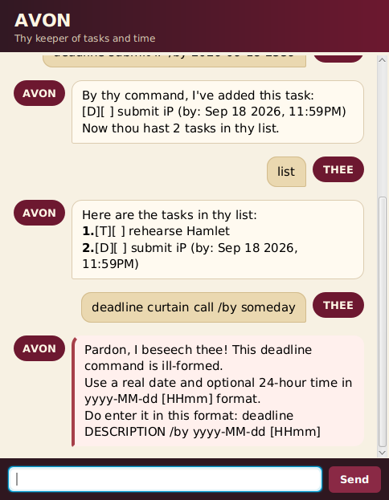

# Avon

_Avon_ is a Shakespearean personal-assistance chatbot created for the Software Engineering course's individual
project. It is built from the Duke greenfield Java project template.



See the [Avon User Guide](docs/README.md) for installation and command details.

## Setting up in Intellij

Prerequisites: JDK 25, update Intellij to the most recent version.

1. Open Intellij (if you are not in the welcome screen, click `File` > `Close Project` to close the existing project first)
1. Open the project into Intellij as follows:
   1. Click `Open`.
   1. Select the project directory, and click `OK`.
   1. If there are any further prompts, accept the defaults.
1. Configure the project to use **JDK 25** (not other versions) as explained in [here](https://www.jetbrains.com/help/idea/sdk.html#set-up-jdk).<br>
   In the same dialog, set the **Project language level** field to the `SDK default` option.
1. After that, run `./gradlew run` from the project root. If the setup is correct, the Avon JavaFX window opens.

**Warning:** Keep the `src\main\java` folder as the root folder for Java files (i.e., don't rename those folders or move Java files to another folder outside of this folder path), as this is the default location some tools (e.g., Gradle) expect to find Java files.

## Building the executable JAR

Run `./gradlew shadowJar` from the project root. The executable JAR is created at
`build/libs/avon.jar` and can be launched using:

```shell
java -jar build/libs/avon.jar
```

## Running tests

Use JDK 25 and run the following command from the project root:

```shell
./gradlew test
```

## Checking commit messages

Enable the tracked commit-message check for this checkout:

```shell
git config core.hooksPath .githooks
```

Compose non-trivial messages in a file, then commit with it. The hook
rejects any message line longer than 72 characters.

```shell
git commit -F path/to/commit-message.txt
git log -1 --format=%B
```

Before pushing, inspect the last five commit subjects separately. The
grading dashboard evaluates them:

```shell
git log -5 --format=%s
```

## Acknowledgement of AI Use

In line with course expectations, AI tools were used throughout the code base. Usage was around AI-5 level in general. 
The requirements of each increment were read, understood and broken down into small steps for the AI to implement. 
After each step, the software was tested, to ensure its behaviour conforms to requirements.
The generated code was also reviewed, and the AI tool would be questioned regarding certain implementation choices. 
If the justifications provided by the AI tool was not accepted, it would be asked to modify its implementation. 
It is hoped that this method of usage does not compromise learning, thus aligning with the course's goals.
